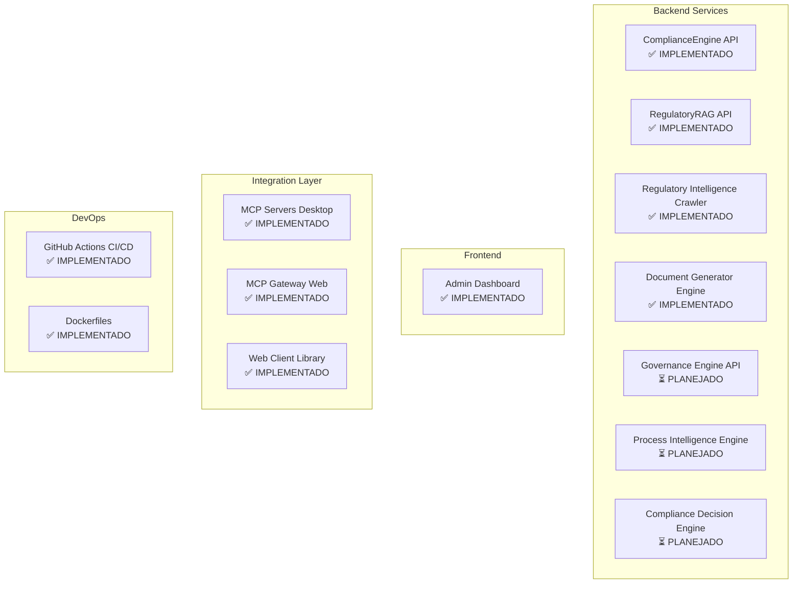
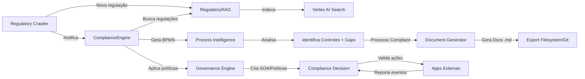

# Implementation Roadmap - ComplianceEngine Platform

**Última Atualização**: 2024-12-23
**Status do Projeto**: 🟢 Em Desenvolvimento Ativo

---

## 📊 Visão Geral do Ecossistema



---

## ✅ Fase 1: Core Platform (CONCLUÍDA)

### 1.1 ComplianceEngine API ✅
**Status**: ✅ Implementado e Testado
**Localização**: `/app/`

**Funcionalidades**:
- ✅ Geração de diagramas BPMN via Gemini
- ✅ Armazenamento de processos no Firestore
- ✅ Análise de compliance vs regulações
- ✅ API keys management (bcrypt)
- ✅ Cache Redis
- ✅ Health checks

**Endpoints Principais**:
- `POST /v1/diagrams/generate` - Gera BPMN de texto
- `POST /v1/processes` - Cria processo
- `GET /v1/processes/{id}` - Busca processo
- `POST /v1/compliance/analyze` - Analisa compliance

**Tecnologias**:
- FastAPI, Python 3.11+
- Vertex AI (Gemini 1.5 Pro)
- Firestore
- Redis

**Próximos Passos**:
- [ ] Rate limiting (CRÍTICO para produção)
- [ ] WAF configuration
- [ ] Secret Manager integration

---

### 1.2 RegulatoryRAG API ✅
**Status**: ✅ Implementado e Testado
**Localização**: `/regulatory-rag-api/`

**Funcionalidades**:
- ✅ Vertex AI Search integration
- ✅ Redis caching (TTL inteligente)
- ✅ Quality scoring (relevance + recency)
- ✅ Semantic search em regulações

**Endpoints Principais**:
- `POST /v1/regulations/search` - Busca semântica
- `GET /v1/regulations/domains` - Lista domínios
- `GET /v1/regulations/{id}` - Detalhes de regulação

**Tecnologias**:
- FastAPI
- Vertex AI Search (Discovery Engine)
- Redis
- Pydantic v2

**Próximos Passos**:
- [ ] Configurar Vertex AI Search data store
- [ ] Importar documentos regulatórios iniciais

---

### 1.3 Admin Dashboard ✅
**Status**: ✅ Implementado
**Localização**: `/admin-dashboard/`

**Funcionalidades**:
- ✅ Overview dashboard
- ✅ API Keys management (CRUD)
- ✅ FinOps tracking (consumo/cobrança de usuários) 🔄 **NOTA**: Precisa adaptação para billing
- ✅ Consumers management
- ✅ Services monitoring
- ✅ Settings
- ✅ Dark mode (gray-950)

**Tecnologias**:
- Next.js 14 (App Router)
- React 18
- TailwindCSS + shadcn/ui
- TanStack Query
- NextAuth.js

**Próximos Passos**:
- [ ] Adaptar FinOps para backoffice de cobrança de usuários (API calls tracking, billing)
- [ ] Integrar dashboard de compliance monitoring em tempo real

---

### 1.4 MCP Integration ✅
**Status**: ✅ Implementado
**Localização**: `/mcp-servers/`

**Componentes**:
1. **ComplianceEngine MCP Server** ✅
   - STDIO transport (desktop apps)
   - 7 tools expostos

2. **RegulatoryRAG MCP Server** ✅
   - STDIO transport
   - 3 tools expostos

3. **MCP HTTP Gateway** ✅
   - HTTP/SSE bridge para web apps
   - Express.js
   - Bearer token auth

4. **Web Client Library** ✅
   - TypeScript client
   - `MCPClient` class

**Tecnologias**:
- @modelcontextprotocol/sdk
- TypeScript
- Express.js
- Zod validation

**Próximos Passos**:
- [ ] MCP Server para Governance Engine (quando implementado)
- [ ] MCP Server para Process Intelligence (quando implementado)

---

### 1.5 CI/CD ✅
**Status**: ✅ Implementado
**Localização**: `/.github/workflows/`

**Workflows**:
1. **deploy.yml** ✅
   - 3 jobs paralelos (ComplianceEngine, RegulatoryRAG, Dashboard)
   - Deploy para Cloud Run
   - Env vars automáticos

2. **test.yml** ✅
   - Python linting (Black, Flake8, MyPy)
   - TypeScript validation
   - Docker build validation
   - Security scanning (Trivy)

**Próximos Passos**:
- [ ] Adicionar jobs para novos microserviços (Crawler, Document Generator, etc.)

---

## 🚧 Fase 2: Regulatory Intelligence (CONCLUÍDA)

### 2.1 Regulatory Intelligence Crawler ✅
**Status**: ✅ Implementado
**Localização**: `/regulatory-intelligence-crawler/`

**Funcionalidades**:
- ✅ Crawler ANEEL (resoluções normativas, homologatórias, notas técnicas)
- ✅ Crawler ONS (procedimentos de rede, submódulos, instruções operacionais)
- ✅ Crawler ARCyber (framework de cibersegurança do setor elétrico)
- ✅ Gemini AI analysis (impacto, classificação)
- ✅ Notification service (email, Slack, webhook)
- ✅ Scheduler (24h automation)
- ✅ Firestore repository

**Endpoints Principais**:
- `POST /v1/crawlers/run` - Trigger manual crawl
- `GET /v1/crawlers/status` - Status dos crawlers
- `GET /v1/updates` - Lista atualizações
- `POST /v1/updates/{id}/analyze` - Análise de impacto

**Tecnologias**:
- FastAPI
- BeautifulSoup (web scraping)
- Vertex AI Gemini (análise)
- Firestore
- AsyncIO scheduler

**Próximos Passos**:
- [ ] **CRÍTICO**: Validar seletores CSS (sites ANEEL/ONS podem mudar estrutura)
- [ ] Implementar PDF extraction (muitos documentos ONS são PDF)
- [ ] Adicionar fontes adicionais (BACEN, SUSEP, etc.)
- [ ] Integrar com RegulatoryRAG (auto-indexar novas regulações)

**Atividades para Agente Futuro**:
```
TAREFA: Validar e ajustar crawlers ANEEL/ONS
1. Acessar sites fonte (www.aneel.gov.br, www.ons.org.br)
2. Inspecionar estrutura HTML (seletores CSS)
3. Ajustar em aneel_crawler.py e ons_crawler.py
4. Testar endpoint POST /v1/crawlers/run
5. Verificar logs para erros de parsing
```

---

## 🚧 Fase 3: Document Generation (CONCLUÍDA)

### 3.1 Document Generator Engine ✅
**Status**: ✅ Implementado
**Localização**: `/document-generator-engine/`

**Funcionalidades**:
- ✅ Conversor BPMN XML → Mermaid flowchart
- ✅ Templates Jinja2 para POPs, Instruções de Trabalho, Checklists
- ✅ Export em Markdown (Git-friendly)
- ✅ Suporte a múltiplos frameworks (ISO 27001, SOC2, PCI-DSS)
- ✅ Audit package export (ZIP)

**Endpoints Principais**:
- `POST /v1/documents/generate` - Gera documentos
- `POST /v1/convert/bpmn-to-mermaid` - Converte BPMN
- `POST /v1/documents/export-package` - Pacote de auditoria
- `GET /v1/templates` - Lista templates

**Tecnologias**:
- FastAPI
- Jinja2
- lxml (XML parsing)
- Mermaid (diagrams as code)

**Próximos Passos**:
- [ ] **Implementar `DocumentGenerator` service** (app/services/document_generator.py)
- [ ] **Implementar schemas** (app/schemas.py)
- [ ] Adicionar templates para SOC2, PCI-DSS, HIPAA
- [ ] Preview de Mermaid (renderizar PNG/SVG)
- [ ] Export para Confluence API

**Atividades para Agente Futuro**:
```
TAREFA: Completar DocumentGenerator service
ARQUIVO: document-generator-engine/app/services/document_generator.py

1. Criar classe DocumentGenerator com métodos:
   - generate_from_process(process_id, bpmn_xml, ...)
   - get_document_path(document_id)
   - generate_audit_package(process_id, control_id)

2. Implementar renderização Jinja2:
   - Carregar templates de app/templates/
   - Popular contexto com dados do processo
   - Incluir Mermaid diagram convertido

3. Salvar arquivos .md em /app/exports/

4. Retornar GeneratedDocument schemas

REFERÊNCIA: Ver main.py para assinatura dos métodos
```

---

## ⏳ Fase 4: Governance & Intelligence (PLANEJADA)

### 4.1 Governance Engine API ⏳
**Status**: ⏳ Planejado (Prioridade ALTA)
**Localização Sugerida**: `/governance-engine-api/`

**Funcionalidades Planejadas**:
1. **SOA Engine**
   - Gera Statement of Applicability automaticamente
   - Contexto da empresa → controles aplicáveis
   - Suporte: ISO 27001, SOC2, PCI-DSS, HIPAA, LGPD

2. **Policy Generator**
   - Cria políticas/procedimentos/normas
   - Alimentado do SOA
   - Templates corporativos

3. **Process Mapper**
   - Mapeia processos existentes → controles
   - Identificação automática de compliance

4. **ISMS Redesigner**
   - Reorganiza processos para formar ISMS certificável
   - Roadmap de implementação

**Endpoints Planejados**:
- `POST /v1/governance/soa/generate`
- `POST /v1/governance/policies/generate`
- `POST /v1/governance/isms/map-processes`
- `POST /v1/governance/isms/redesign`

**Tecnologias Sugeridas**:
- FastAPI
- Vertex AI Gemini (geração de políticas)
- Firestore (frameworks library)
- Jinja2 (templates)

**Atividades para Implementação**:
```
ETAPA 1: Setup básico (1-2 dias)
1. Criar estrutura de pastas
2. Implementar main.py com endpoints básicos
3. Criar schemas.py (SOA, Policy, ISMS models)
4. Docker + requirements.txt

ETAPA 2: Framework Library (2-3 dias)
1. Criar frameworks/iso27001_2022.json
   - 93 controles com keywords, requirements, evidências
2. Criar frameworks/soc2_trust_principles.json
3. Criar frameworks/pci_dss_v4.json
4. Loader service para carregar frameworks

ETAPA 3: SOA Engine (3-4 dias)
1. Implementar app/services/soa_engine.py
2. Lógica de seleção de controles (contexto → aplicabilidade)
3. Gemini analysis para justificativas

ETAPA 4: Policy Generator (4-5 dias)
1. Implementar app/services/policy_generator.py
2. Templates Jinja2 para políticas
3. Integração com SOA

ETAPA 5: Process Mapper + ISMS Redesigner (5-7 dias)
1. Implementar BPMN analyzer
2. Keyword matching (processos → controles)
3. Gap analysis
4. Roadmap generator
```

---

### 4.2 Process Intelligence Engine ⏳
**Status**: ⏳ Planejado (Prioridade ALTA)
**Localização Sugerida**: `/process-intelligence-engine-api/`

**Funcionalidades Planejadas**:
1. **BPMN Parser**
   - Lê BPMN XML
   - Extrai atividades, atores, evidências

2. **Control Mapper**
   - Identifica controles atendidos
   - Confiança score (IA)

3. **Gap Analyzer**
   - Identifica gaps vs controle
   - Tipos: missing_recurrence, missing_evidence, missing_monitoring

4. **Remediation Advisor**
   - Sugere correções (BPMN changes)
   - Esforço estimado
   - Roadmap de correção

**Endpoints Planejados**:
- `POST /v1/intelligence/analyze-process`
- `POST /v1/intelligence/enhance-process`
- `POST /v1/intelligence/generate-evidence-plan`
- `GET /v1/intelligence/frameworks`

**Tecnologias Sugeridas**:
- FastAPI
- Vertex AI Gemini (análise semântica)
- lxml (BPMN parsing)
- Firestore (control library)

**Exemplo de Análise**:
```json
{
  "process_id": "proc_001",
  "controls_addressed": [
    {
      "control_id": "ISO27001:A.8.7",
      "confidence": 0.95,
      "coverage": "partial",
      "coverage_percentage": 45
    }
  ],
  "gaps_identified": [
    {
      "gap_type": "missing_recurrence",
      "severity": "high",
      "remediation": "Adicionar automação via GPO"
    }
  ],
  "compliance_score": 43
}
```

**Atividades para Implementação**:
```
ETAPA 1: BPMN Parser (2-3 dias)
1. Criar app/services/bpmn_parser.py
2. Parse XML → extract tasks, gateways, flows
3. Identificar evidências mencionadas

ETAPA 2: Control Library (3-4 dias)
1. Criar frameworks/iso27001_2022_controls.json
   - Cada controle com:
     - keywords (para matching)
     - bpmn_activity_patterns (regex)
     - requirements (implementation, evidence, recurrence)
     - common_gaps

ETAPA 3: Control Mapper (4-5 dias)
1. Implementar app/services/control_mapper.py
2. Keyword matching (BPMN activities → controles)
3. Gemini semantic analysis (melhorar matching)

ETAPA 4: Gap Analyzer (3-4 dias)
1. Implementar app/services/gap_analyzer.py
2. Comparar processo real vs requirements do controle
3. Identificar gaps (falta evidência, recorrência, etc.)

ETAPA 5: Remediation Advisor (3-4 dias)
1. Implementar app/services/remediation_advisor.py
2. Sugerir mudanças no BPMN
3. Estimar esforço
4. Gerar enhanced BPMN
```

---

### 4.3 Compliance Decision Engine ⏳
**Status**: ⏳ Planejado (Prioridade MÉDIA)
**Localização Sugerida**: `/compliance-decision-engine-api/`

**Funcionalidades Planejadas**:
1. **Policy Decision Point (PDP)**
   - Valida ações em tempo real vs políticas
   - Retorna allow/deny + justificativa

2. **Event Reporting**
   - Aplicações reportam eventos de volta
   - Audit trail completo

3. **Compliance Monitoring**
   - Dashboard de compliance por app
   - Alertas de violações

**Endpoints Planejados**:
- `POST /v1/compliance/validate` - Valida ação
- `POST /v1/compliance/events` - Reporta evento
- `GET /v1/compliance/metrics` - Métricas

**Tecnologias Sugeridas**:
- FastAPI
- Open Policy Agent (OPA) ou JSON Logic
- Redis (cache de decisões)
- Firestore (políticas)

**Exemplo de Uso**:
```typescript
// Aplicação de RH valida contratação
const validation = await client.validateAction({
  action: 'create_user_access',
  context: {
    role: 'Developer',
    access_level: 'admin',  // ⚠️
  },
  policies: ['access_control_policy']
});

if (!validation.allowed) {
  // Bloqueado!
  console.error(validation.reason);
  // "Acesso admin requer aprovação do CISO"
}
```

**Atividades para Implementação**:
```
ETAPA 1: PDP Core (3-4 dias)
1. Criar app/services/policy_evaluator.py
2. Implementar rule engine (JSON Logic)
3. Cache de decisões (Redis)

ETAPA 2: Policy Format (2-3 dias)
1. Definir formato de políticas em JSON
2. Converter políticas do Governance Engine → regras executáveis

ETAPA 3: Event Tracking (2-3 dias)
1. Implementar app/services/event_tracker.py
2. Armazenar eventos no Firestore
3. Audit trail queries

ETAPA 4: SDKs (3-4 dias)
1. TypeScript SDK (packages/compliance-sdk/)
2. Python SDK
3. Exemplos de integração
```

---

## 📋 Atividades Prioritárias por Persona

### Para Desenvolvedor Backend Python
**Prioridade**: Governance Engine + Process Intelligence

1. **Implementar Governance Engine** (10-15 dias)
   - Arquivo: `governance-engine-api/`
   - Seguir estrutura da Fase 4.1
   - Começar por SOA Engine

2. **Implementar Process Intelligence** (10-15 dias)
   - Arquivo: `process-intelligence-engine-api/`
   - Seguir estrutura da Fase 4.2
   - Começar por BPMN Parser

3. **Completar Document Generator service** (2-3 dias)
   - Arquivo: `document-generator-engine/app/services/document_generator.py`
   - Ver atividades na Fase 3.1

### Para Desenvolvedor Frontend (React/Next.js)
**Prioridade**: FinOps Adaptation + Compliance Dashboard

1. **Adaptar FinOps para Billing** (3-5 dias)
   - Arquivo: `admin-dashboard/src/app/(dashboard)/finops/`
   - Tracking de API calls por cliente
   - Billing/invoicing UI
   - Cost analytics

2. **Implementar Compliance Monitoring Dashboard** (5-7 dias)
   - Real-time compliance score por app
   - Violation tracking
   - Alertas

### Para DevOps Engineer
**Prioridade**: Produção Readiness

1. **Rate Limiting** (2-3 dias)
   - Implementar em todos os microserviços
   - Nginx rate limiting ou FastAPI middleware

2. **Secret Manager Integration** (1-2 dias)
   - Migrar env vars para GCP Secret Manager

3. **WAF Configuration** (2-3 dias)
   - Google Cloud Armor
   - DDoS protection

4. **Monitoring** (3-4 dias)
   - Cloud Logging
   - Cloud Monitoring
   - Alerting

### Para Data Engineer / ML Engineer
**Prioridade**: Regulatory Crawler Validation + RAG Enhancement

1. **Validar Crawlers ANEEL/ONS** (2-3 dias)
   - Ver atividades na Fase 2.1
   - Ajustar seletores CSS

2. **Configurar Vertex AI Search** (3-4 dias)
   - Data store configuration
   - Import documentos regulatórios
   - Tuning de relevância

3. **PDF Extraction para ONS** (2-3 dias)
   - Muitos procedimentos ONS são PDFs
   - Implementar OCR (Vertex AI Document AI)

---

## 🔄 Integrações Entre Serviços



---

## 📊 Métricas de Progresso

### Microserviços
- ✅ ComplianceEngine API: 100%
- ✅ RegulatoryRAG API: 100%
- ✅ Regulatory Crawler: 100%
- ✅ Document Generator: 85% (falta `DocumentGenerator` service)
- ⏳ Governance Engine: 0%
- ⏳ Process Intelligence: 0%
- ⏳ Compliance Decision: 0%

### Frontend
- ✅ Admin Dashboard: 90% (falta adaptação FinOps)

### Integration
- ✅ MCP Servers: 100%
- ✅ MCP Gateway: 100%
- ✅ Web Client: 100%

### DevOps
- ✅ CI/CD: 80% (falta workflows para novos serviços)
- ⚠️ Produção Readiness: 40% (falta rate limiting, WAF, secrets)

### Documentação
- ✅ README por serviço: 100%
- ✅ Technical Evaluation: 100%
- ✅ Project Status: 100%
- ✅ Implementation Roadmap: 100%

**Progresso Geral**: **~60%**

---

## 🚀 Próximos Milestones

### Milestone 1: Production Ready (2-3 semanas)
- [ ] Rate limiting em todos os serviços
- [ ] WAF + Secret Manager
- [ ] Validar crawlers ANEEL/ONS
- [ ] Configurar Vertex AI Search
- [ ] Completar Document Generator service

### Milestone 2: Governance & Intelligence (4-6 semanas)
- [ ] Implementar Governance Engine completo
- [ ] Implementar Process Intelligence completo
- [ ] Integração entre serviços

### Milestone 3: Decision Engine & Monitoring (3-4 semanas)
- [ ] Implementar Compliance Decision Engine
- [ ] Adaptar FinOps Dashboard
- [ ] Compliance Monitoring Dashboard

### Milestone 4: Polish & Launch (2-3 semanas)
- [ ] Testes end-to-end
- [ ] Documentação de usuário
- [ ] Onboarding guides
- [ ] Marketing material

---

## 📞 Como Colaborar

### Para Novos Agentes/Desenvolvedores

1. **Leia este roadmap completo**
2. **Escolha uma tarefa baseada na sua persona**
3. **Siga as atividades detalhadas na seção relevante**
4. **Use a estrutura de pastas existente como referência**
5. **Documente mudanças no README do serviço**
6. **Crie PR com descrição clara**

### Padrões de Código
- **Python**: FastAPI + Pydantic v2 + async/await
- **TypeScript**: Strict mode + Zod validation
- **Commits**: Conventional Commits (feat:, fix:, docs:)
- **Documentação**: README.md por serviço

### Questões?
- Consulte READMEs específicos de cada serviço
- Veja TECHNICAL_EVALUATION.md para arquitetura geral
- Siga estrutura de pastas de serviços existentes

---

**Documento vivo - atualizar conforme progresso!**
