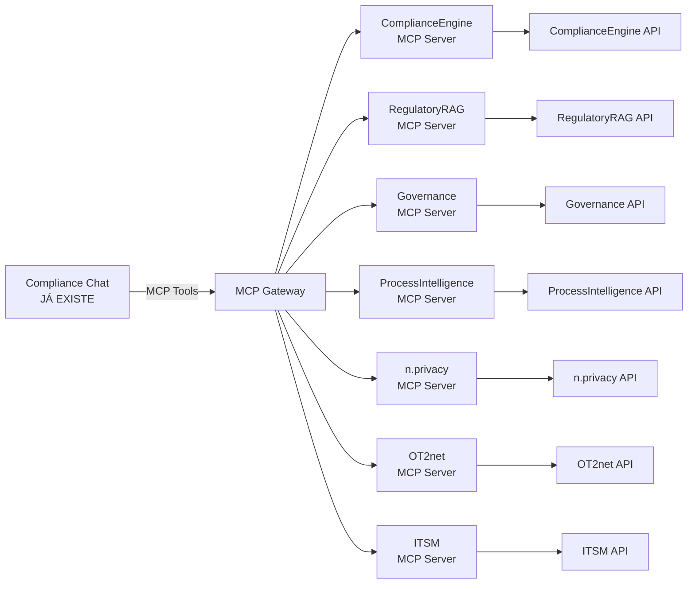

# Integração: Compliance Chat → ComplianceEngine Platform via MCP

**Data**: 2024-12-23
**Status**: Arquitetura de Integração

---

## 🎯 Visão Geral

O **Compliance Chat** (aplicação já em produção) vai consumir todas as funcionalidades da **ComplianceEngine Platform** via **MCP (Model Context Protocol)**.



---

## ✅ MCP Servers Existentes

### 1. **ComplianceEngine MCP Server** ✅
**Localização**: `/mcp-servers/compliance-engine/`
**Status**: ✅ Implementado

**Tools Disponíveis**:
```typescript
1. generate_bpmn_diagram(description, context?)
   - Gera diagrama BPMN de descrição em linguagem natural
   - Retorna: BPMN XML + preview

2. create_process(name, bpmn_xml, category)
   - Cria processo no sistema
   - Retorna: process_id

3. get_process(process_id)
   - Busca processo por ID
   - Retorna: Processo completo

4. analyze_compliance(process_id, regulations)
   - Analisa conformidade de processo vs regulações
   - Retorna: Gaps, score, recomendações

5. list_processes(category?, status?)
   - Lista processos
   - Retorna: Array de processos

6. update_process(process_id, updates)
   - Atualiza processo
   - Retorna: Processo atualizado

7. delete_process(process_id)
   - Remove processo
   - Retorna: Confirmação
```

---

### 2. **RegulatoryRAG MCP Server** ✅
**Localização**: `/mcp-servers/regulatory-rag/`
**Status**: ✅ Implementado

**Tools Disponíveis**:
```typescript
1. search_regulations(query, options?)
   - Busca semântica em regulações
   - options: { domain?, top_k?, datasets? }
   - Retorna: Regulações com score de relevância

2. list_domains()
   - Lista domínios regulatórios disponíveis
   - Retorna: Array de domínios

3. get_regulation(regulation_id)
   - Busca regulação específica
   - Retorna: Regulação completa
```

**🆕 Tools a Adicionar**:
```typescript
4. search_by_datasets(query, datasets: string[])
   - Busca APENAS nos datasets selecionados
   - datasets: ["aneel", "bacen", "cvm", "ons", "lgpd"]
   - Retorna: Resultados filtrados por dataset

   Exemplo:
   await mcp.callTool("search_by_datasets", {
     query: "prazo notificação incidente",
     datasets: ["aneel", "arcyber"]
   })

5. get_dataset_info(dataset_id)
   - Retorna informações sobre dataset
   - Retorna: { name, document_count, last_updated, category }

6. list_available_datasets()
   - Lista todos datasets disponíveis
   - Retorna: [
       { id: "aneel", name: "ANEEL", category: "energy", ... },
       { id: "bacen", name: "BACEN", category: "finance", ... },
       ...
     ]
```

---

## 🆕 MCP Servers a Criar

### 3. **Governance MCP Server** (PLANEJADO)
**Localização**: `/mcp-servers/governance/`
**Status**: ⏳ A implementar

**Tools Planejados**:
```typescript
1. generate_soa(framework, company_context)
   - Gera Statement of Applicability
   - Frameworks: ISO27001, SOC2, PCI-DSS, LGPD
   - Retorna: SOA completo com controles aplicáveis

2. generate_policy(type, framework_control?, template?)
   - Gera política/procedimento/norma
   - type: "policy" | "procedure" | "guideline"
   - Retorna: Documento em Markdown

3. map_processes_to_controls(process_ids, framework)
   - Mapeia processos existentes → controles
   - Retorna: Mapeamento + gaps

4. redesign_isms(soa_id, current_processes)
   - Reorganiza processos para formar ISMS
   - Retorna: Roadmap de implementação
```

---

### 4. **ProcessIntelligence MCP Server** (PLANEJADO)
**Localização**: `/mcp-servers/process-intelligence/`
**Status**: ⏳ A implementar

**Tools Planejados**:
```typescript
1. analyze_process_compliance(bpmn_xml, frameworks)
   - Analisa processo e identifica controles + gaps
   - Retorna: { controls_addressed, gaps, compliance_score }

2. enhance_process(process_id, apply_recommendations?)
   - Retorna BPMN melhorado com gaps corrigidos
   - Retorna: Enhanced BPMN XML + lista de mudanças

3. generate_evidence_plan(process_id, control_id)
   - Gera plano de coleta de evidências
   - Retorna: Lista de evidências necessárias

4. get_control_requirements(framework, control_id)
   - Retorna requirements de um controle específico
   - Retorna: { implementation, evidence, recurrence, monitoring }
```

---

### 5. **n.privacy MCP Server** (PLANEJADO)
**Localização**: `/mcp-servers/nprivacy/`
**Status**: ⏳ A implementar

**Tools Planejados**:
```typescript
1. create_ropa(description)
   - Cria ROPA a partir de descrição em linguagem natural
   - Analisa: lifecycle completo, segurança, riscos, DPIA
   - Retorna: ROPA estruturado completo

2. evaluate_dpia_necessity(ropa_id)
   - Avalia se DPIA é necessário
   - Retorna: { required: boolean, justification, criteria }

3. generate_dpia(ropa_id)
   - Gera DPIA completo
   - Retorna: DPIA documento

4. assess_security_measures(ropa_id)
   - Avalia adequação de medidas de segurança
   - Retorna: { adequate: boolean, gaps, recommendations }

5. process_dsar(request_type, subject_id)
   - Processa Data Subject Access Request
   - request_type: "access" | "portability" | "deletion" | "rectification"
   - Retorna: Dados exportados ou confirmação

6. generate_cookie_policy(website_context)
   - Gera política de cookies
   - Retorna: Política em Markdown
```

---

### 6. **OT2net MCP Server** (PLANEJADO)
**Localização**: `/mcp-servers/ot2net/`
**Status**: ⏳ A implementar

**Tools Planejados**:
```typescript
1. capture_operator_interview(description, operator_id)
   - Fase 1: Captura entrevista de operador
   - Retorna: { process_id, bpmn_xml, validation_required }

2. submit_to_committee(process_id, presentation)
   - Fase 2: Submete ao comitê
   - Retorna: { submission_id, status: "pending_review" }

3. analyze_ons_compliance(process_id)
   - Fase 3: Confronta com procedimentos ONS
   - Retorna: {
       applicable_procedures,
       conformities,
       gaps,
       compensatory_measures,
       alternatives,
       compliance_score
     }

4. approve_with_compensatory(process_id, approved_measures)
   - Fase 3: Aprova com medidas compensatórias
   - Retorna: BPMN final com medidas aplicadas

5. implement_process(process_id)
   - Fase 4: Implementa processo
   - Gera documentação, treina, monitora
   - Retorna: { documentation, training_status, monitoring }

6. get_ons_procedures(category?)
   - Lista procedimentos ONS disponíveis
   - Retorna: Array de procedimentos
```

---

### 7. **ITSM MCP Server** (PLANEJADO)
**Localização**: `/mcp-servers/itsm/`
**Status**: ⏳ A implementar

**Tools Planejados**:
```typescript
1. create_it_process(description, technician_id)
   - Cria processo de TI a partir de descrição
   - Analisa vs ITIL + CIS Controls automaticamente
   - Retorna: {
       process_id,
       bpmn_xml,
       itil_analysis,
       cis_analysis,
       structured_data
     }

2. analyze_itil_compliance(process_id)
   - Analisa conformidade ITIL v4
   - Retorna: { process_type, compliant, gaps, improvements }

3. analyze_cis_controls(process_id)
   - Identifica controles CIS aplicáveis
   - Retorna: {
       applicable_controls,
       implementation_status,
       gaps,
       security_score
     }

4. get_process_structured_data(process_id)
   - Retorna dados estruturados para consumo
   - Retorna: { sla, roles, tools, kpis, risks }

5. search_processes(filters)
   - Busca processos por critérios
   - filters: { category?, team?, cis_control?, itil_process? }
   - Retorna: Array de processos
```

---

## 📱 Como o Compliance Chat Consome

### Exemplo 1: Buscar Regulações (Multi-dataset)

```typescript
// No Compliance Chat (já existente)

// Usuário seleciona datasets
const selectedDatasets = ["aneel", "bacen", "cvm"]

// Usuário pergunta
const userMessage = "Quais são os requisitos de cibersegurança para instituições financeiras?"

// Chat chama MCP
const results = await mcp.callTool("search_by_datasets", {
  query: userMessage,
  datasets: selectedDatasets
})

// results contém regulações de BACEN + CVM (não ANEEL)
// Chat formata resposta com citações
```

---

### Exemplo 2: Gerar ROPA (n.privacy)

```typescript
// Usuário descreve processamento
const description = `
  Processamos dados de clientes no CRM Salesforce.
  Coletamos nome, email, CPF, telefone.
  Usamos para vendas e marketing.
  Compartilhamos com gateway de pagamento.
`

// Chat chama MCP do n.privacy
const ropa = await mcp.callTool("create_ropa", {
  description: description
})

// ropa retorna estrutura completa:
// - Lifecycle (coleta → uso → descarte)
// - Medidas de segurança
// - Avaliação de risco
// - DPIA necessário?
// - Compliance LGPD

// Chat exibe resumo + oferece:
// - "Ver ROPA completo"
// - "Gerar DPIA" (se necessário)
// - "Avaliar medidas de segurança"
```

---

### Exemplo 3: Processo ONS (OT2net)

```typescript
// Fase 1: Captura entrevista
const interview = `
  Quando alarme toca, verifico no SCADA.
  Se real, ligo pro ONS em 30 min.
  Aciono equipe de campo...
`

const process = await mcp.callTool("capture_operator_interview", {
  description: interview,
  operator_id: "op_123"
})

// Chat exibe: "Processo capturado! BPMN gerado com 8 atividades."

// Fase 2: Usuário aprova internamente (fora do chat)

// Fase 3: Análise ONS
const onsAnalysis = await mcp.callTool("analyze_ons_compliance", {
  process_id: process.process_id
})

// Chat exibe:
// ✅ Conformidades: 5
// ⚠️ Gaps: 2 (registro SAGE, equipe backup)
// 💡 Medidas compensatórias sugeridas
// 🔄 Alternativas de processo
```

---

### Exemplo 4: Processo ITIL (ITSM)

```typescript
// Técnico descreve atividade
const description = `
  Quando recebo ticket de reset de senha, verifico CPF,
  reseto no AD, mando senha temporária por SMS.
`

const itProcess = await mcp.callTool("create_it_process", {
  description: description,
  technician_id: "tech_456"
})

// Chat exibe resultado estruturado:
// 📊 Processo: Reset de Senha
// 🎯 ITIL: Service Request Management (95% conforme)
// 🔒 CIS Controls: 6.1, 6.3, 6.5
// ⚠️ Gaps: SLA não definido, falta MFA
// 💡 Recomendações: Adicionar 2FA, definir SLA 15min

// Usuário pode:
// - "Gerar POP completo"
// - "Ver BPMN"
// - "Implementar controles CIS"
```

---

## 🔧 Atualização Necessária: MCP Gateway

**Localização**: `/mcp-servers/gateway/`

O **MCP Gateway** (já existe) precisa ser atualizado para incluir novos endpoints quando os MCP Servers forem criados:

```typescript
// mcp-servers/gateway/src/index.ts

// ========== RegulatoryRAG (NOVO) ==========
app.post("/v1/tools/rag/search_by_datasets", validateApiKey, async (req, res) => {
  const { query, datasets } = req.body

  const response = await axios.post(
    `${RAG_API_URL}/v1/regulations/search`,
    {
      query,
      filters: { sources: datasets }
    }
  )

  res.json(response.data)
})

app.get("/v1/tools/rag/list_datasets", validateApiKey, async (req, res) => {
  // Retornar lista de datasets disponíveis
  res.json({
    datasets: [
      { id: "aneel", name: "ANEEL", category: "energy", ... },
      { id: "bacen", name: "BACEN", category: "finance", ... },
      // ...
    ]
  })
})

// ========== n.privacy (QUANDO IMPLEMENTAR) ==========
app.post("/v1/tools/nprivacy/create_ropa", validateApiKey, async (req, res) => {
  const { description } = req.body

  const response = await axios.post(
    `${NPRIVACY_API_URL}/v1/ropa/create`,
    { description }
  )

  res.json(response.data)
})

// ========== OT2net (QUANDO IMPLEMENTAR) ==========
app.post("/v1/tools/ot2net/capture_interview", validateApiKey, async (req, res) => {
  const { description, operator_id } = req.body

  const response = await axios.post(
    `${OT2NET_API_URL}/v1/processes/capture`,
    { description, operator_id }
  )

  res.json(response.data)
})

// ========== ITSM (QUANDO IMPLEMENTAR) ==========
app.post("/v1/tools/itsm/create_process", validateApiKey, async (req, res) => {
  const { description, technician_id } = req.body

  const response = await axios.post(
    `${ITSM_API_URL}/v1/processes/create`,
    { description, technician_id }
  )

  res.json(response.data)
})
```

---

## 📊 Roadmap de Integração

### Fase 1: Melhorar MCP Servers Existentes (1 semana)
```
✅ Atualizar RegulatoryRAG MCP Server
   - Adicionar search_by_datasets
   - Adicionar list_available_datasets
   - Adicionar get_dataset_info

✅ Atualizar MCP Gateway
   - Adicionar endpoints para novos tools
```

### Fase 2: n.privacy API + MCP Server (2-3 semanas)
```
✅ Implementar n.privacy API
✅ Criar n.privacy MCP Server
✅ Integrar com MCP Gateway
✅ Testar no Compliance Chat existente
```

### Fase 3: OT2net API + MCP Server (3-4 semanas)
```
✅ Implementar OT2net API (4 fases)
✅ Criar OT2net MCP Server
✅ Integrar com MCP Gateway
✅ Testar no Compliance Chat existente
```

### Fase 4: ITSM API + MCP Server (2-3 semanas)
```
✅ Implementar ITSM API
✅ Criar ITSM MCP Server
✅ Integrar com MCP Gateway
✅ Testar no Compliance Chat existente
```

### Fase 5: Governance + ProcessIntelligence (4-6 semanas)
```
✅ Implementar Governance Engine API
✅ Implementar ProcessIntelligence API
✅ Criar MCP Servers respectivos
✅ Integrar com MCP Gateway
```

---

## 🎯 Benefícios da Arquitetura MCP

### Para o Compliance Chat (já existente):
1. ✅ **Zero mudança de código**: Apenas adicionar novos `mcp.callTool()`
2. ✅ **Desacoplamento**: Chat não conhece APIs, só MCP tools
3. ✅ **Escalabilidade**: Adicionar novos tools sem mudar chat
4. ✅ **Type-safe**: MCP SDK garante tipos corretos

### Para a ComplianceEngine Platform:
1. ✅ **Única interface**: MCP para tudo (desktop + web)
2. ✅ **Reutilização**: Mesmos MCP Servers para múltiplos clients
3. ✅ **Documentação automática**: MCP tools auto-documentados
4. ✅ **Versionamento**: Fácil versionar tools

---

## 🚀 Próximo Passo Imediato

**Recomendação**: Começar por **n.privacy API + MCP Server** porque:
1. Workflow mais simples (sem aprovações multi-fase)
2. Pode ser testado imediatamente no Chat existente
3. Maior ROI (pode monetizar rápido)
4. Serve de template para OT2net e ITSM

**Quer que eu implemente?**
- n.privacy API completa (schemas + endpoints)
- n.privacy MCP Server (6 tools)
- Atualização do MCP Gateway
- Exemplos de uso no Compliance Chat

---

*Documento vivo - atualizar conforme novos MCP Servers forem adicionados*
