# ness. ComplianceEngine

[](https://opensource.org/licenses/MIT)
[](https://www.python.org/downloads/)
[](https://fastapi.tiangolo.com/)
[](https://nextjs.org/)

**Multi-tenant SaaS platform for intelligent compliance management** powered by Google Cloud Vertex AI and Gemini.

## 🎯 Overview

ComplianceEngine is an API-first platform that enables organizations to:
- **Map business processes** into structured BPMN diagrams using AI
- **Analyze compliance** with regulatory frameworks (ANEEL, ONS, LGPD, GDPR, etc.)
- **Track compliance scores** in real-time
- **Manage API keys** and monitor usage
- **Control costs** with FinOps capabilities

## 🏗️ Architecture

### System Overview

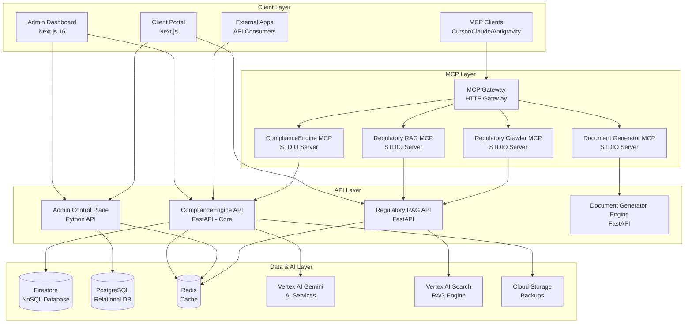

### Request Flow

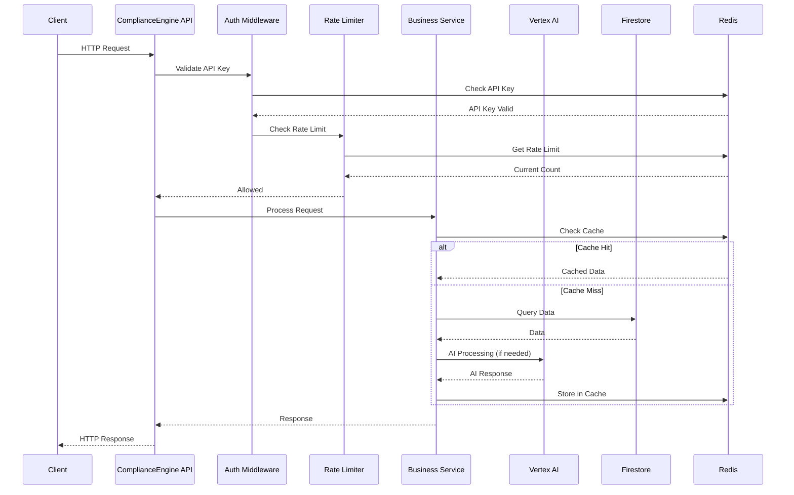

### Services Architecture

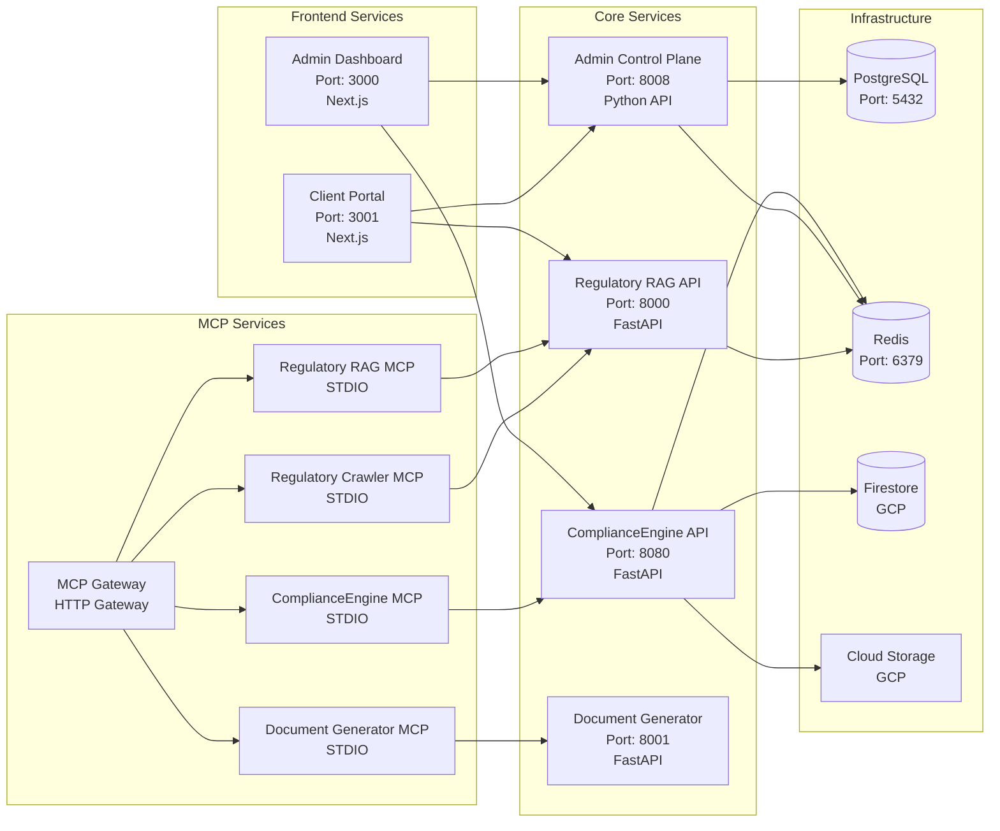

### MCP Integration Flow

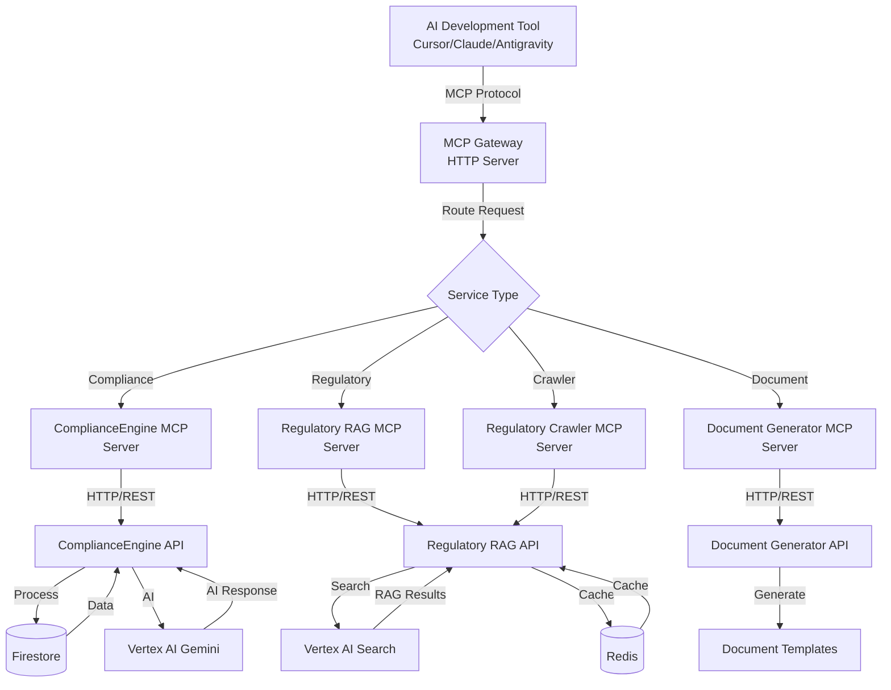

### Data Flow

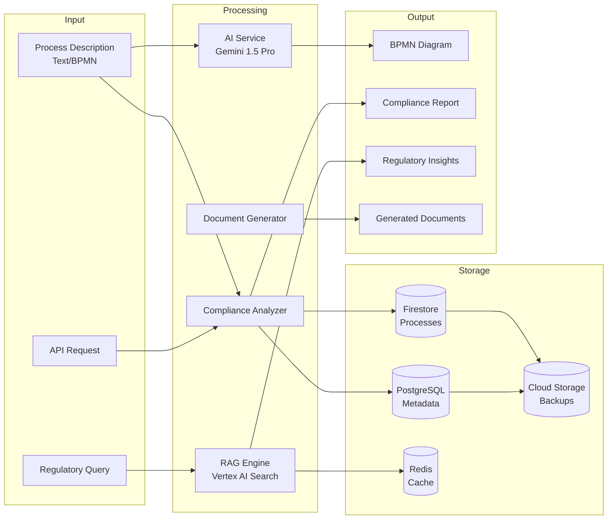

## 📦 Components

### 1. ComplianceEngine API (`app/`)

**Core REST API for compliance management**

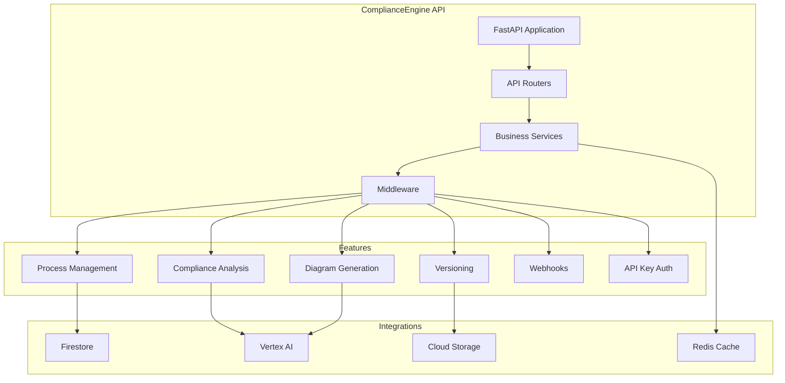

**Features:**
- ✅ FastAPI REST API
- ✅ Firestore for data persistence
- ✅ Vertex AI Gemini for AI features
- ✅ Rate limiting and monitoring
- ✅ API Key authentication
- ✅ Process versioning
- ✅ Webhook notifications
- ✅ Real-time compliance scoring

### 2. Admin Dashboard (`admin-dashboard/`)

**Human interface for platform management**

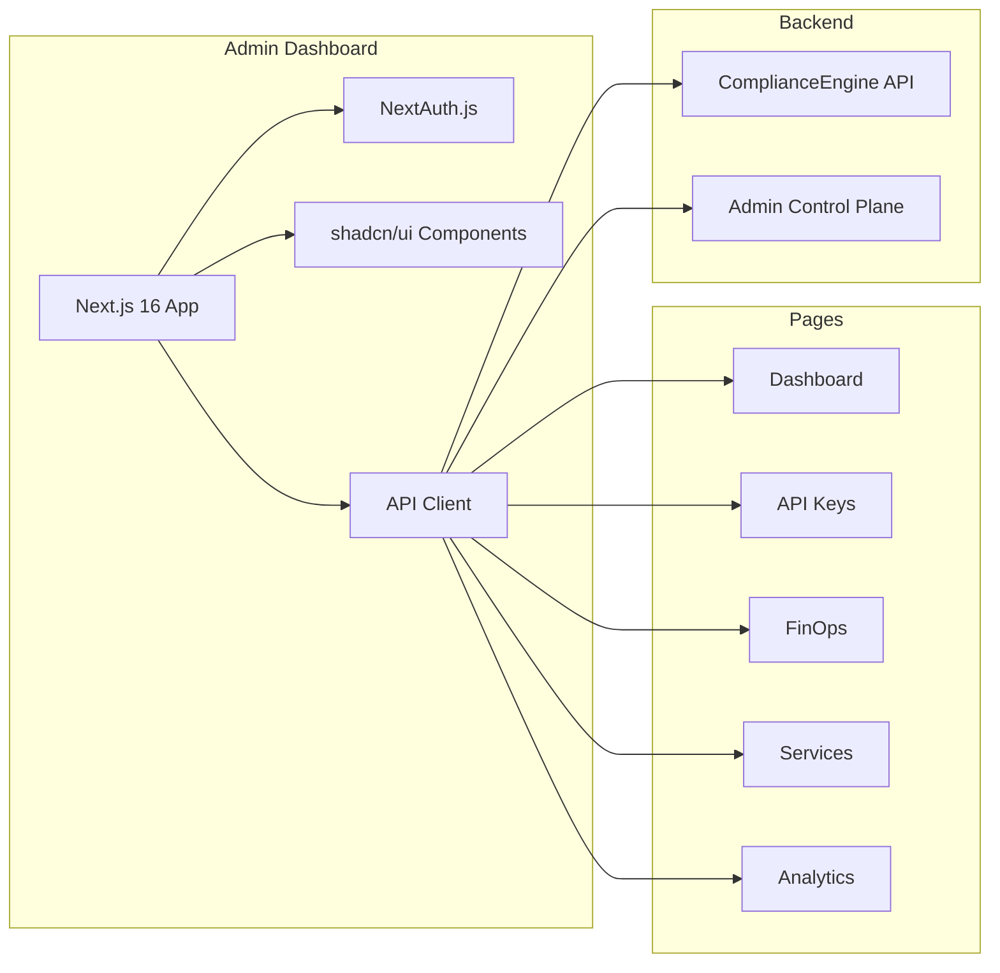

**Features:**
- ✅ Next.js 16 with TypeScript
- ✅ NextAuth.js for authentication
- ✅ shadcn/ui components
- ✅ API Key management
- ✅ Cost tracking (FinOps)
- ✅ Service monitoring
- ✅ Analytics dashboard

### 3. MCP Servers (`mcp-servers/`)

**Model Context Protocol servers for AI tool integration**

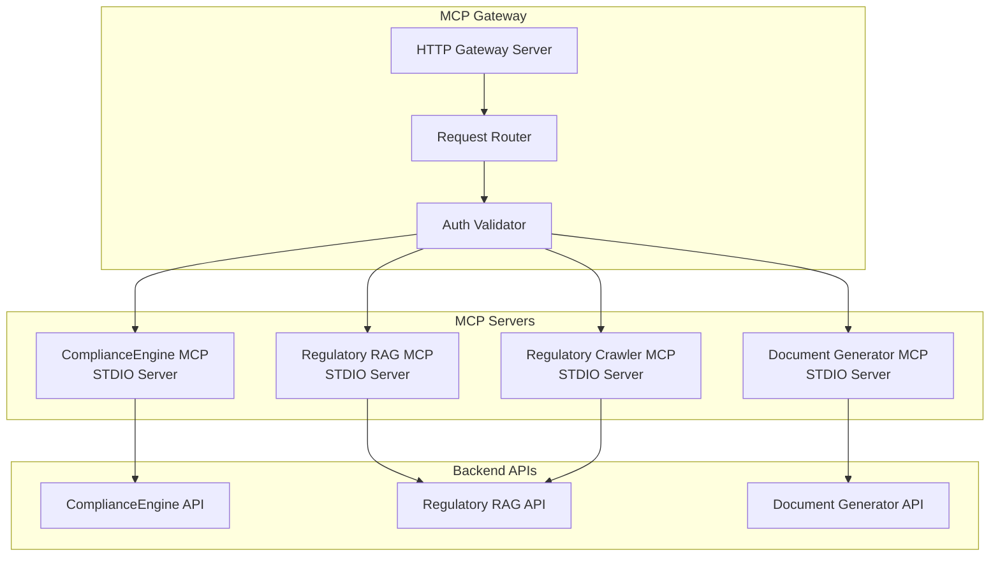

**Available MCP Servers:**
- ✅ **ComplianceEngine MCP** - Core compliance operations
- ✅ **Regulatory RAG MCP** - Regulatory intelligence search
- ✅ **Document Generator MCP** - BPMN to Mermaid conversion
- ✅ **Regulatory Crawler MCP** - Automated regulation crawling
- ✅ **MCP Gateway** - HTTP gateway for MCP servers

### 4. Additional Services

#### Admin Control Plane (`admin-control-plane/`)

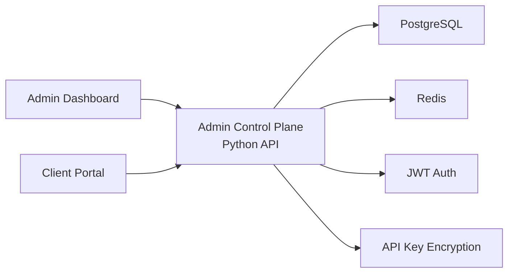

**Features:**
- ✅ Admin API for platform management
- ✅ PostgreSQL for relational data
- ✅ JWT authentication
- ✅ API key encryption

#### Client Portal (`client-portal/`)

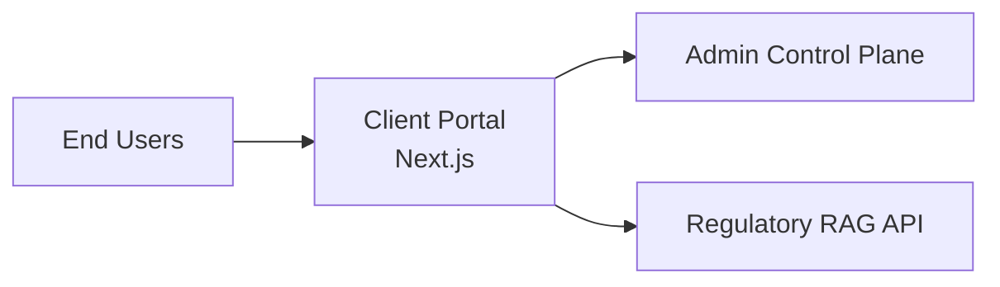

**Features:**
- ✅ Client-facing interface
- ✅ Process visualization
- ✅ Compliance reports
- ✅ Self-service API key management

#### Regulatory RAG API (`regulatory-rag-api/`)

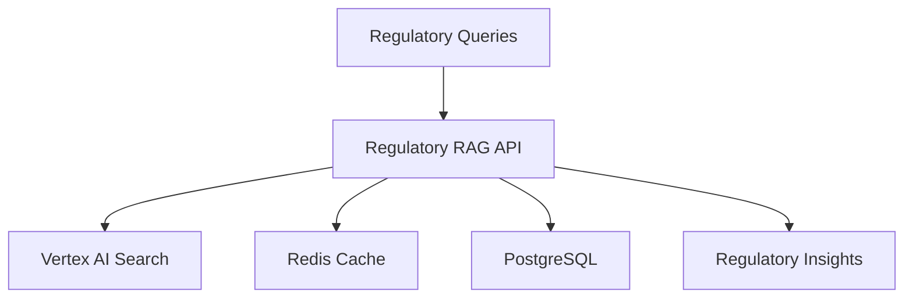

**Features:**
- ✅ Semantic search with Vertex AI Search
- ✅ Intelligent caching with Redis
- ✅ Quality scoring (relevância + recency)
- ✅ Domain-specific filtering
- ✅ Multiple regulatory frameworks (ANEEL, ONS, LGPD, GDPR, etc.)

#### Document Generator Engine (`document-generator-engine/`)

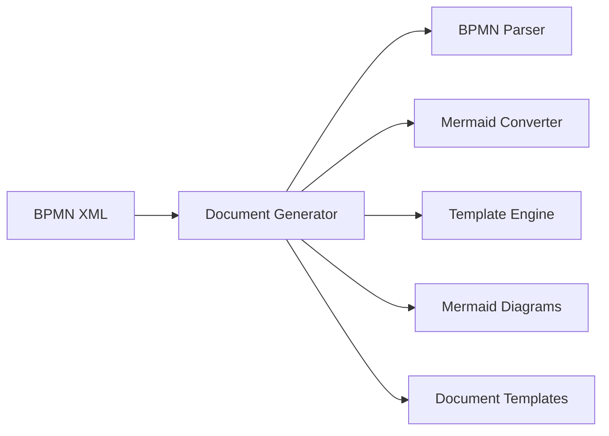

**Features:**
- ✅ BPMN to Mermaid conversion
- ✅ Document template generation
- ✅ Process documentation automation

## 🚀 Quick Start

### Prerequisites
- Python 3.11+
- Node.js 20+
- Google Cloud Project with billing enabled
- Docker & Docker Compose (for local development)

### Local Development

```bash
# 1. Clone repository
git clone https://github.com/resper1965/nprocess.git
cd nprocess

# 2. Copy environment variables
cp .env.example .env

# 3. Configure .env with your credentials
# - GOOGLE_CLOUD_PROJECT=nprocess
# - GCP_PROJECT_ID=nprocess
# - Add Vertex AI credentials if using AI features

# 4. Install dependencies
make install
# or
pip install -r requirements.txt

# 5. Run locally
uvicorn app.main:app --reload --port 8080

# 6. Access API
# - API: http://localhost:8080
# - Docs: http://localhost:8080/docs
```

### Docker Development

```bash
# Start all services
make docker-up
# or
docker-compose up -d

# View logs
make docker-logs
# or
docker-compose logs -f

# Stop services
make docker-down
# or
docker-compose down
```

## 📚 Documentation

- **[Quick Start Guide](docs/QUICK_START.md)** - Get started quickly
- **[Integration Guide](docs/INTEGRATION.md)** - Integrate the API
- **[Architecture](docs/ARCHITECTURE.md)** - System architecture
- **[API Documentation](https://compliance-engine-5wqihg7s7a-uc.a.run.app/docs)** - Interactive API docs
- **[Security](docs/SECURITY.md)** - Security practices
- **[Deployment](docs/DEPLOY_STATUS.md)** - Deployment guide

## 🔐 Authentication

### API Authentication
- **API Key** in header: `X-API-Key: <your-key>` or `Authorization: Bearer <your-key>`
- Create keys via Admin Dashboard or `/v1/my/api-keys` endpoint

### Admin Dashboard
- **URL**: https://compliance-engine-admin-dashboard-5wqihg7s7a-uc.a.run.app
- **Credentials**: `admin@company.com` / `admin123`

## 🌐 Production URLs

- **API**: https://compliance-engine-5wqihg7s7a-uc.a.run.app
- **API Docs**: https://compliance-engine-5wqihg7s7a-uc.a.run.app/docs
- **Admin Dashboard**: https://compliance-engine-admin-dashboard-5wqihg7s7a-uc.a.run.app

## 🧪 Testing

```bash
# Run all tests
make test

# Run with coverage
pytest tests/ -v --cov=app --cov-report=html

# Run specific test
pytest tests/test_api.py::test_endpoint -v
```

## 🔧 Development

```bash
# Format code
make format

# Lint code
make lint

# Run security scans
make security-scan

# Clean build artifacts
make clean
```

## 📋 Project Structure

```
nprocess/
├── app/                    # Main FastAPI application
│   ├── main.py            # Application entry point
│   ├── routers/           # API endpoints
│   ├── services/          # Business logic
│   ├── schemas/           # Pydantic models
│   └── middleware/       # Custom middleware
├── admin-dashboard/       # Admin interface (Next.js)
├── admin-control-plane/  # Admin API
├── client-portal/         # Client interface
├── mcp-servers/          # MCP protocol servers
├── regulatory-rag-api/   # RAG service
├── docs/                 # Documentation
├── tests/                # Test suite
├── scripts/              # Utility scripts
└── specs/                # Specifications
```

## 🤝 Contributing

See [CONTRIBUTING.md](.github/CONTRIBUTING.md) for guidelines.

## 📄 License

This project is licensed under the MIT License - see [LICENSE](LICENSE) file for details.

## 🔗 Links

- **GitHub**: https://github.com/resper1965/nprocess
- **API Docs**: https://compliance-engine-5wqihg7s7a-uc.a.run.app/docs
- **Admin Dashboard**: https://compliance-engine-admin-dashboard-5wqihg7s7a-uc.a.run.app

## 🆘 Support

- **Issues**: https://github.com/resper1965/nprocess/issues
- **Security**: security@ness.com.br

---

**Built with ❤️ by [ness.](https://ness.com.br)**
