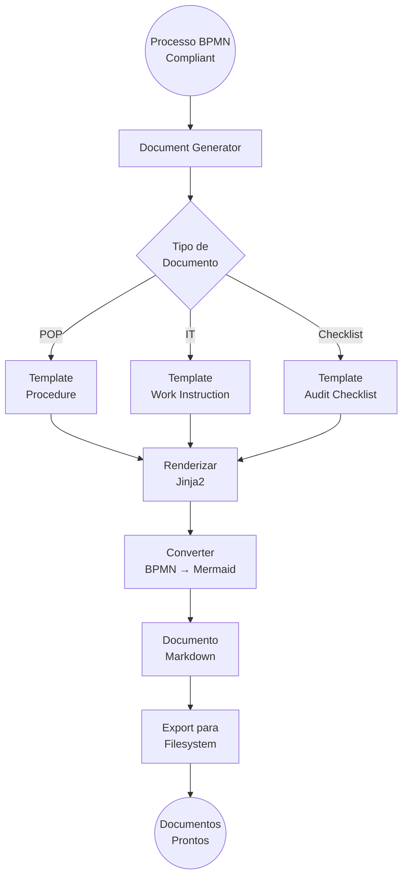

# Document Generator Engine 📄

Microserviço de geração automática de documentação de compliance em **Markdown** com **Mermaid diagrams**.

## 🎯 Visão Geral

O Document Generator Engine converte processos BPMN validados em documentação formal de compliance, incluindo:

- ✅ **POPs** (Procedimentos Operacionais Padrão) em Markdown
- ✅ **Instruções de Trabalho** (Work Instructions)
- ✅ **Checklists de Auditoria**
- ✅ **Diagramas Mermaid** (BPMN → Mermaid flowchart)
- ✅ **Pacotes de Auditoria** completos (ZIP)

## 🚀 Diferencial: Markdown + Mermaid

### Por que Markdown?

1. **Versionamento Git-friendly**: Diff legível, histórico claro
2. **Multiplataforma**: Renderiza em GitHub, GitLab, Confluence, Notion, etc.
3. **Fácil edição**: Texto puro, sem lock-in de formato
4. **Automação**: Fácil de gerar e processar programaticamente

### Por que Mermaid?

1. **Diagrams as Code**: BPMN convertido para sintaxe declarativa
2. **Versionável**: Diagrama em texto puro (não binário)
3. **Renderização Universal**: GitHub, GitLab, VSCode, Obsidian renderizam nativamente
4. **Sem dependência de ferramentas**: Não precisa de Visio, Draw.io, etc.

## 📊 Fluxo de Geração



## 🔧 Endpoints API

### Gerar Documentos
```bash
POST /v1/documents/generate
{
  "process_id": "proc_001",
  "process_name": "Instalação de Antivírus",
  "bpmn_xml": "<bpmn:definitions>...</bpmn:definitions>",
  "controls_addressed": [
    {
      "framework": "ISO27001:2022",
      "control_id": "A.8.7",
      "coverage": 100
    }
  ],
  "company_context": {
    "company_name": "FinTech XYZ",
    "process_owner": "João Silva",
    "approver": "Maria Santos (CISO)"
  },
  "document_types": ["procedure", "work_instruction", "audit_checklist"],
  "export_format": "markdown"
}
```

**Response**:
```json
[
  {
    "document_id": "doc_pop_001",
    "type": "procedure",
    "title": "POP-TI-001 - Instalação e Gestão de Antivírus",
    "file_path": "/exports/doc_pop_001.md",
    "download_url": "/v1/documents/doc_pop_001/download"
  },
  {
    "document_id": "doc_wi_001",
    "type": "work_instruction",
    "title": "IT-WI-001 - Instalação via GPO",
    "file_path": "/exports/doc_wi_001.md",
    "download_url": "/v1/documents/doc_wi_001/download"
  },
  {
    "document_id": "doc_checklist_001",
    "type": "audit_checklist",
    "title": "Checklist ISO27001 A.8.7",
    "file_path": "/exports/doc_checklist_001.md",
    "download_url": "/v1/documents/doc_checklist_001/download"
  }
]
```

### Converter BPMN → Mermaid
```bash
POST /v1/convert/bpmn-to-mermaid
{
  "bpmn_xml": "<bpmn:definitions>...</bpmn:definitions>"
}
```

**Response**:
```json
{
  "mermaid": "```mermaid\nflowchart TD\n    start((Start))\n    task1[Install Antivirus]\n    ...\n```"
}
```

### Exportar Pacote de Auditoria
```bash
POST /v1/documents/export-package?process_id=proc_001&control_id=ISO27001:A.8.7
```

**Response**: ZIP file contendo:
- POP em Markdown
- Instrução de Trabalho em Markdown
- Checklist de Auditoria em Markdown
- Diagrama BPMN em Mermaid
- Evidências template

## 📄 Exemplo de Documento Gerado

### POP (Procedimento Operacional Padrão)

```markdown
# POP-TI-001 - Instalação e Gestão de Antivírus

**Framework**: ISO27001:2022
**Controle**: A.8.7 - Protection against malware
**Versão**: 1.0
**Data de Vigência**: Após aprovação
**Próxima Revisão**: Anual

---

## 1. Objetivo

Este procedimento estabelece as diretrizes para instalação, configuração,
atualização e monitoramento de software antivírus...

## 4. Procedimento Detalhado

### 4.1 Fluxo do Processo

\`\`\`mermaid
flowchart TD
    start((Novo Computador))
    gpo[GPO Auto-Deploy]
    install[Instalar Kaspersky]
    register[Registrar no KSC]
    update[Primeira Atualização]
    log[Logging no Splunk]
    end_node((Concluído))

    start --> gpo
    gpo --> install
    install --> register
    register --> update
    update --> log
    log --> end_node
\`\`\`

### 4.2 Passos Detalhados

#### Passo 1: Instalação Automática via GPO

Novo computador é adicionado ao domínio Active Directory...

...
```

## 🎨 Templates Disponíveis

### Procedures
- `iso27001_control_procedure.md.j2` - ISO 27001 controles
- `soc2_control_procedure.md.j2` - SOC2 trust principles
- `pci_dss_requirement.md.j2` - PCI-DSS requirements

### Work Instructions
- `technical_instruction.md.j2` - Instruções técnicas
- `operational_instruction.md.j2` - Instruções operacionais

### Checklists
- `audit_checklist.md.j2` - Checklists de auditoria

## 🐳 Deploy

```bash
docker build -t document-generator .
docker run -p 8004:8004 document-generator
```

## 🔄 Integração com ComplianceEngine

```python
# 1. Processo validado no ComplianceEngine
process = compliance_engine.get_process("proc_001")

# 2. Gerar documentos
response = requests.post(
    "http://document-generator:8004/v1/documents/generate",
    json={
        "process_id": process.id,
        "bpmn_xml": process.bpmn_xml,
        "controls_addressed": process.controls_addressed,
        ...
    }
)

# 3. Documentos em Markdown gerados!
documents = response.json()

# 4. Export para Git repository (versionamento)
for doc in documents:
    with open(f"docs/{doc['file_path']}", 'w') as f:
        f.write(doc['content'])

# 5. Commit to Git
git.add("docs/")
git.commit(m="docs: Update compliance procedures from BPMN")
git.push()
```

## 📈 Estatísticas

- **Tempo de geração**: < 2 segundos por documento
- **Conversão BPMN → Mermaid**: < 500ms
- **Frameworks suportados**: ISO 27001, SOC2, PCI-DSS, HIPAA, LGPD, NIST, CIS
- **Formato de output**: Markdown (100% texto puro)

## 💡 Vantagens sobre Documentação Manual

| Manual | Automatizado |
|--------|--------------|
| ❌ Desatualizado | ✅ Sempre sincronizado com processo real |
| ❌ Genérico | ✅ Específico da implementação |
| ❌ Inconsistente | ✅ Template padronizado |
| ❌ Difícil de versionar (PDF/DOCX) | ✅ Git-friendly (Markdown) |
| ❌ Diagrama binário (Visio) | ✅ Diagrama como código (Mermaid) |
| ❌ Horas de trabalho manual | ✅ Segundos de geração automática |

## 🚀 Roadmap

- [ ] Preview de Mermaid (renderizar para PNG/SVG)
- [ ] Templates multilíngues (pt-BR, en-US, es-ES)
- [ ] Export para Confluence (via API)
- [ ] Export para SharePoint
- [ ] Assinaturas digitais automáticas
- [ ] Geração de PDF a partir de Markdown (opcional)

## 📄 Licença

Proprietário - ComplianceEngine Platform
