```mermaid
graph TD
  Start[Início] --> Task1[Download Instalador]
  Task1 --> Task2[Executar Instalação]
  Task2 --> Gateway{Instalação OK?}
  Gateway -->|Sim| Task3[Configurar Políticas]
  Gateway -->|Não| Task4[Abrir Chamado]
  Task3 --> End[Fim]
  Task4 --> End
```

# Document Generator MCP Server

MCP Server for the Document Generator Engine - Generate compliance documentation in Markdown format with Mermaid diagrams.

## 🎯 Overview

This MCP server exposes the Document Generator Engine capabilities through the Model Context Protocol, enabling AI assistants and applications to:

- **Generate compliance documents** (POPs, Work Instructions, Checklists) from BPMN processes
- **Convert BPMN to Mermaid** flowcharts for embedding in documentation
- **Export audit packages** with all documentation and evidences
- **List available templates** for different compliance frameworks

## 🛠️ Tools Provided

### 1. `generate_documents`

Generate compliance documentation from BPMN process definition.

**Input**:
```json
{
  "process_id": "proc_001",
  "process_name": "Instalação de Antivírus Corporativo",
  "bpmn_xml": "<bpmn:definitions>...</bpmn:definitions>",
  "controls_addressed": ["ISO27001:A.8.7", "SOC2:CC6.1"],
  "company_context": {
    "company_name": "ACME Corp",
    "sector": "financial_services"
  },
  "document_types": ["procedure", "checklist"]
}
```

**Output**:
```json
{
  "process_id": "proc_001",
  "process_name": "Instalação de Antivírus Corporativo",
  "documents_generated": 2,
  "documents": [
    {
      "type": "procedure",
      "format": "markdown",
      "filename": "POP_InstalacaoAntivirus.md",
      "size_bytes": 12450,
      "download_url": "/v1/documents/doc_12345/download"
    },
    {
      "type": "checklist",
      "format": "markdown",
      "filename": "Checklist_ISO27001_A87.md",
      "size_bytes": 5120,
      "download_url": "/v1/documents/doc_12346/download"
    }
  ],
  "controls_covered": ["ISO27001:A.8.7", "SOC2:CC6.1"]
}
```

**Document Types**:
- **`procedure`** - Standard Operating Procedure (POP) with full process details
- **`work_instruction`** - Step-by-step technical instructions
- **`checklist`** - Audit/compliance verification checklist

**Supported Frameworks**:
- ISO 27001, SOC2, PCI-DSS, HIPAA
- LGPD, ANPD (Brazilian privacy)
- CIS Controls, NIST CSF
- ITIL v4

### 2. `convert_bpmn_to_mermaid`

Convert BPMN 2.0 XML to Mermaid flowchart syntax.

**Input**:
```json
{
  "bpmn_xml": "<bpmn:definitions>...</bpmn:definitions>"
}
```

**Output**:
```

```

**Use Cases**:
- Embedding process diagrams in README files
- Creating visual documentation for GitHub/GitLab
- Generating diagrams for Confluence pages
- Git-friendly process visualization

### 3. `export_package`

Export complete audit package for a control.

**Input**:
```json
{
  "process_id": "proc_001",
  "control_id": "ISO27001:A.8.7",
  "format": "zip"
}
```

**Output**:
```json
{
  "process_id": "proc_001",
  "control_id": "ISO27001:A.8.7",
  "format": "zip",
  "package_size_bytes": 45600,
  "message": "Audit package generated successfully. Package includes all documentation..."
}
```

**Package Contents**:
- All generated documents (POPs, Work Instructions, Checklists)
- BPMN diagrams (XML + Mermaid)
- Evidence templates
- Control mapping documentation

### 4. `list_templates`

List all available document templates.

**Output**:
```json
{
  "procedures": [
    {
      "id": "iso27001_control_procedure",
      "description": "ISO 27001 control implementation procedure"
    },
    {
      "id": "soc2_control_procedure",
      "description": "SOC2 control implementation procedure"
    }
  ],
  "work_instructions": [
    {
      "id": "technical_instruction",
      "description": "Technical work instruction for IT tasks"
    }
  ],
  "checklists": [
    {
      "id": "audit_checklist",
      "description": "Audit verification checklist"
    }
  ]
}
```

## 📦 Installation

### Prerequisites

- Node.js 18+
- Access to Document Generator Engine API

### Install Dependencies

```bash
cd mcp-servers/document-generator
npm install
npm run build
```

## ⚙️ Configuration

### Environment Variables

- `DOC_GEN_API_URL` - Document Generator Engine API URL (default: `http://localhost:8004`)
- `API_KEY` - API authentication key (optional)

### Claude Desktop Configuration

Add to `~/Library/Application Support/Claude/claude_desktop_config.json`:

```json
{
  "mcpServers": {
    "document-generator": {
      "command": "node",
      "args": ["/absolute/path/to/mcp-servers/document-generator/build/index.js"],
      "env": {
        "DOC_GEN_API_URL": "https://document-generator-xxx.run.app",
        "API_KEY": "ce_live_..."
      }
    }
  }
}
```

### VS Code / Cursor Configuration

Add to `.vscode/settings.json`:

```json
{
  "mcp.servers": {
    "document-generator": {
      "command": "node",
      "args": ["${workspaceFolder}/mcp-servers/document-generator/build/index.js"],
      "env": {
        "DOC_GEN_API_URL": "http://localhost:8004"
      }
    }
  }
}
```

## 🚀 Usage Examples

### Example 1: Generate POP from BPMN

```typescript
// Call generate_documents tool
const result = await mcp.call("generate_documents", {
  process_id: "antivirus_install",
  process_name: "Instalação de Antivírus Corporativo",
  bpmn_xml: bpmnXmlContent,
  controls_addressed: ["ISO27001:A.8.7"],
  company_context: {
    company_name: "TechCorp",
    sector: "technology"
  },
  document_types: ["procedure", "work_instruction"]
});
```

### Example 2: Convert BPMN to Mermaid for README

```typescript
// Call convert_bpmn_to_mermaid tool
const result = await mcp.call("convert_bpmn_to_mermaid", {
  bpmn_xml: bpmnXmlContent
});

// Result includes Mermaid syntax ready to embed
console.log(result.mermaid);
```

### Example 3: Export Audit Package

```typescript
// Call export_package tool
const result = await mcp.call("export_package", {
  process_id: "antivirus_install",
  control_id: "ISO27001:A.8.7",
  format: "zip"
});
```

## 📄 Generated Document Format

All documents are generated in **Markdown + Mermaid** format:

### Benefits:
- ✅ **Git-friendly** - Readable diffs in version control
- ✅ **Versionable** - Track changes over time
- ✅ **Renderable** - Displays beautifully on GitHub, GitLab, Confluence
- ✅ **Portable** - Plain text, works everywhere
- ✅ **Searchable** - Easy to grep and search

### Example POP Structure:

```markdown
# POP-001: Instalação de Antivírus Corporativo

## 1. Objetivo
Estabelecer procedimento padronizado para instalação...

## 2. Escopo
Aplica-se a todos os endpoints corporativos...

## 3. Responsabilidades
- **TI**: Executar instalação
- **Segurança**: Validar conformidade

## 4. Procedimento

```mermaid
graph TD
  Start[Início] --> Task1[Download Instalador]
  ...
```



### 4.1 Download do Instalador
1. Acessar portal de TI
2. Baixar versão aprovada
...

## 5. Controles Atendidos
- ISO 27001: A.8.7 - Protection against malware
- SOC2: CC6.1 - Logical security controls

## 6. Evidências
- Screenshot de instalação completa
- Log do Windows Defender
```

## 🔗 Integration with Other MCP Servers

Document Generator MCP works seamlessly with other ComplianceEngine MCP servers:

```typescript
// 1. Generate BPMN with ComplianceEngine MCP
const bpmn = await mcp.call("generate_bpmn", {
  description: "Instalação de antivírus corporativo via GPO"
});

// 2. Map controls with ComplianceEngine MCP
const controls = await mcp.call("map_controls", {
  process_id: "proc_001",
  bpmn_xml: bpmn.bpmn_xml,
  framework: "ISO27001"
});

// 3. Generate documentation with Document Generator MCP
const docs = await mcp.call("generate_documents", {
  process_id: "proc_001",
  process_name: "Instalação de Antivírus",
  bpmn_xml: bpmn.bpmn_xml,
  controls_addressed: controls.controls_mapped
});
```

## 🛡️ Best Practices

1. **Always provide company_context** for more tailored documentation
2. **Specify document_types** to generate only what you need
3. **Use descriptive process_names** for better document titles
4. **Include all controls_addressed** for complete audit trail
5. **Export packages** before audits for organized delivery

## 📊 API Compatibility

This MCP server is compatible with Document Generator Engine API v1.0.0+

**Tested with**:
- Claude Desktop 1.0+
- VS Code MCP Extension
- Cursor IDE
- Windsurf IDE

## 🔧 Development

```bash
# Watch mode for development
npm run dev

# Build for production
npm run build

# Run MCP server
npm start
```

## 📚 Related Documentation

- [Document Generator Engine API](../../document-generator-engine/README.md)
- [MCP Integration Architecture](../MCP_INTEGRATION_ARCHITECTURE.md)
- [ComplianceEngine Platform Overview](../../README.md)

## 🆘 Troubleshooting

### Server won't start
- Check that `DOC_GEN_API_URL` is set correctly
- Verify API is running: `curl http://localhost:8004/health`
- Check Node.js version: `node --version` (requires 18+)

### Documents not generating
- Verify BPMN XML is valid BPMN 2.0 format
- Check that controls exist in framework database
- Review API logs for detailed error messages

### Mermaid conversion fails
- Ensure BPMN XML contains proper flow elements
- Check for unsupported BPMN elements
- Validate XML structure

## 📝 License

MIT
